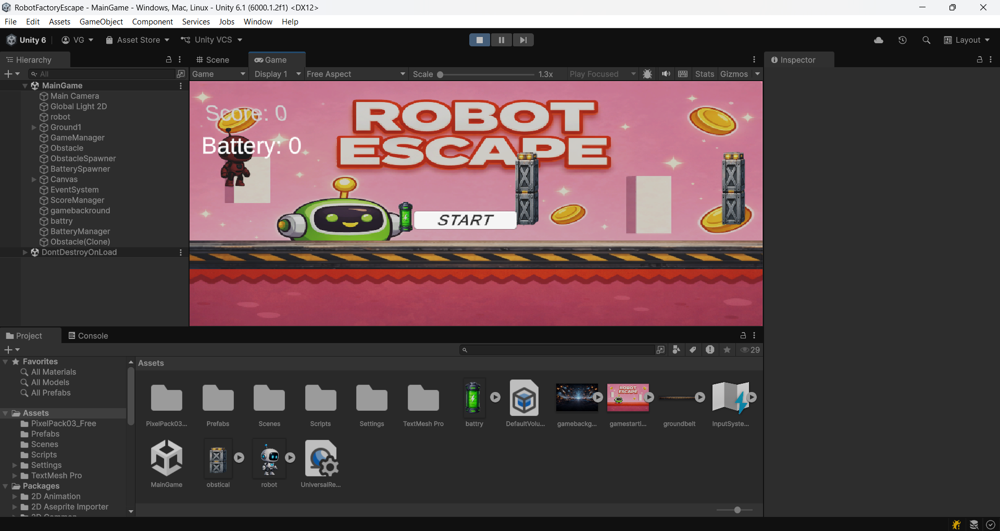
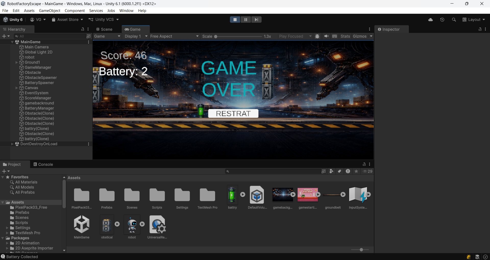
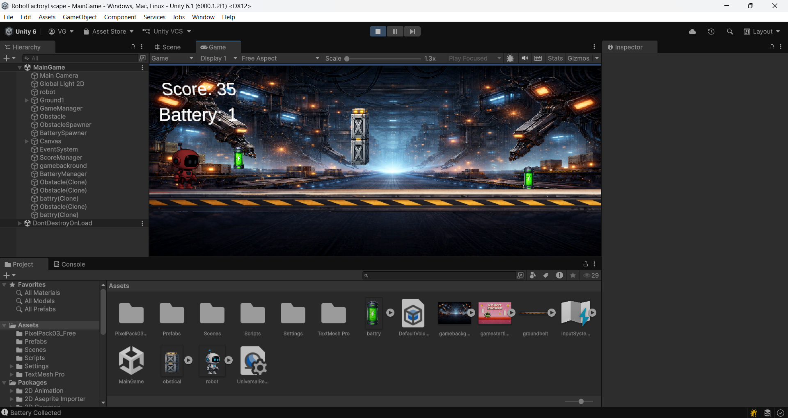

# Robot Factory Escape

🎮 A 2D Endless Runner Game made in Unity

## 🚀 About Game
In this game, the player escapes from a robot factory while collecting batteries and avoiding obstacles.

## 🎯 Features
- Battery collection system 🔋
- Endless running gameplay 🏃
- Obstacles and challenges 🤖
- Increasing difficulty 📈

## 🛠️ Tech Used
- Unity Engine
- C#
- Visual Studio

## 🎮 Controls
- Jump: Space / Tap
- Move: Arrow keys

## 📸 Screenshots

## 👨‍💻 Developer
Vitthal Golde
